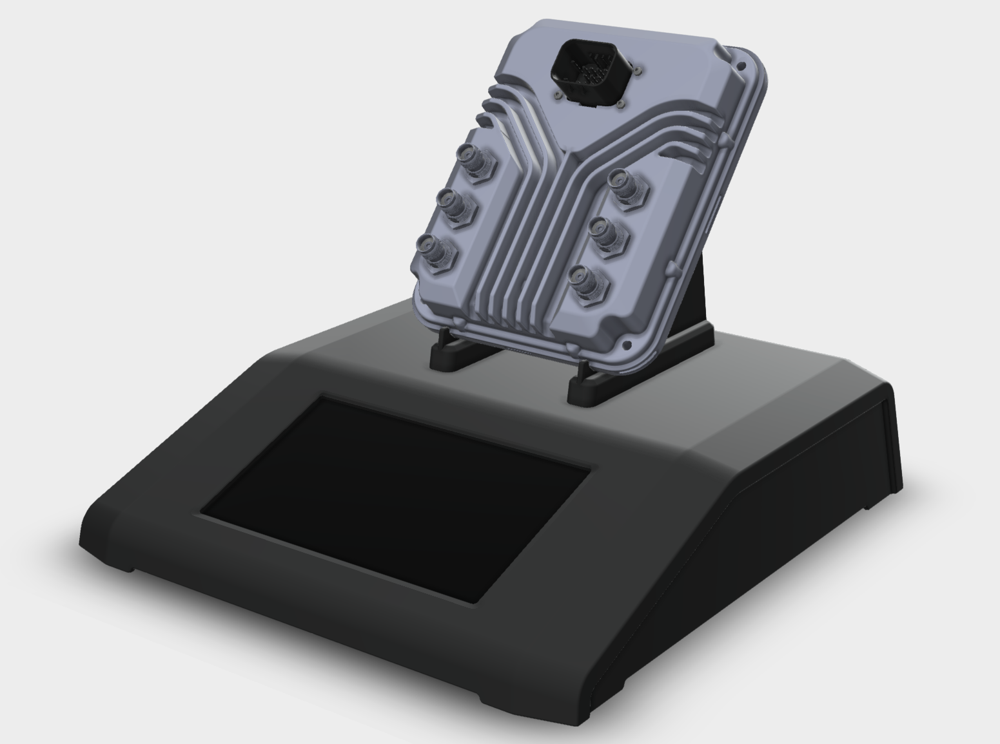
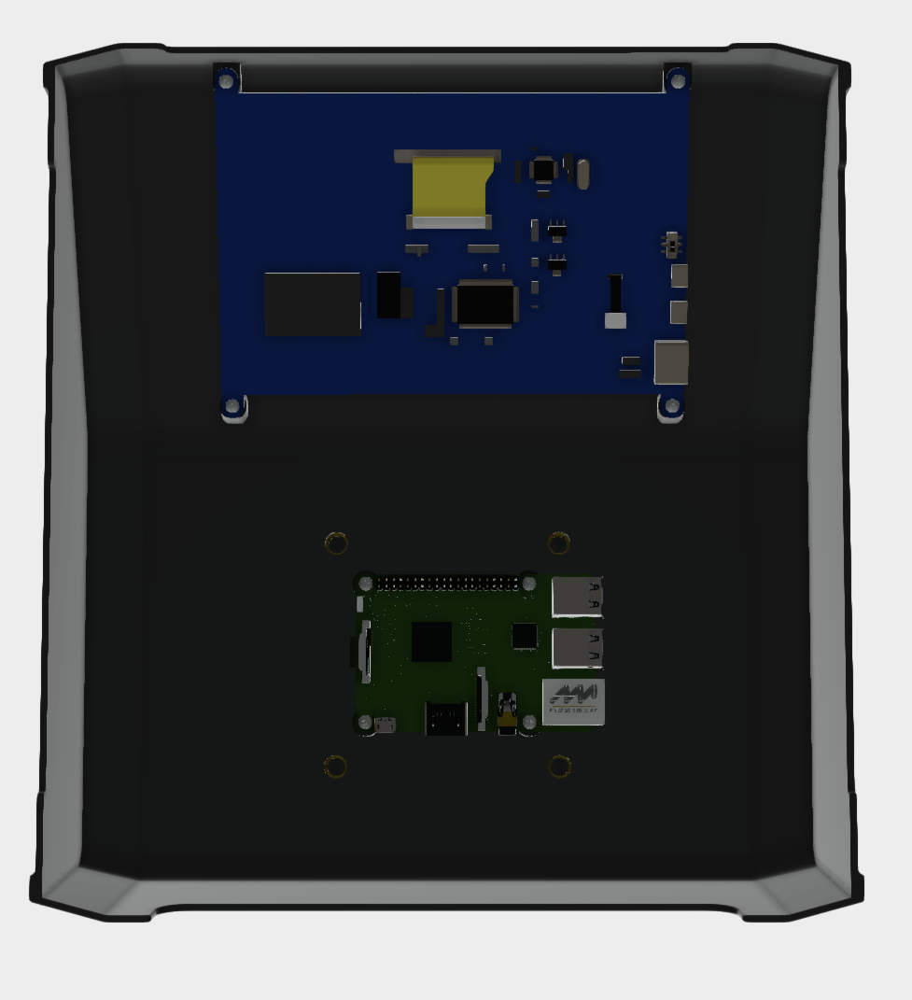

# TradeShowDisplay-Pi
Trade Show Display based on Raspberry Pi and Anthias Digital Signage

# Bill of Materials (BoM)
1. Raspberry Pi 4
2. 7-Inch 1024x600 Screen [https://www.amazon.com/gp/product/B09XKC53NH](https://www.amazon.com/gp/product/B09XKC53NH)
3. 3D Printed Display (STEP Included)

# Raspberry Pi Installation Instructions
1. Install Raspberry Pi OS Lite onto SD Card using Raspberry Pi Imager
2. Edit config.txt to add the following lines:
  * hdmi_force_hotplug=1
  * hdmi_group=2
  * hdmi_mode=87
  * hdmi_cvt=1024 600 60 3 0 0 0
  * hdmi_drive=1
3. Start Raspberry Pi and Log In. Run the following command while connected to network:
`bash <(curl -sL https://install-anthias.srly.io)`
4. Reboot, log in via IP Address, and add content